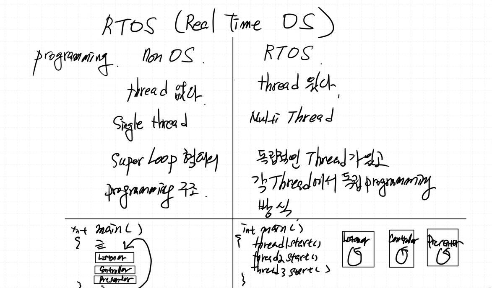
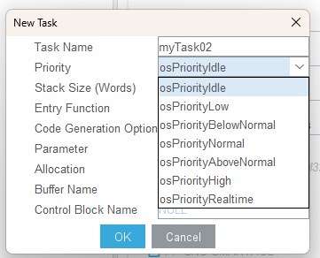
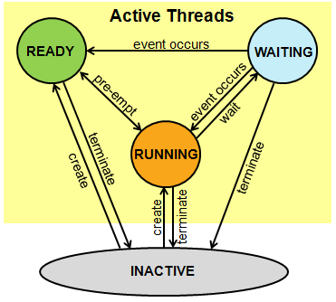

# RTOS

## NoneOS vs RTOS
 

- RTOS rough exp: 우선순위가 있는 OS

## RTOS
- 용어 정리 
  - word: cpu가 한번에 처리할 수 있는 단위(레지스터 크기 stm32f411re에서는 4바이트임) 
  - 태스크의 우선순위: idle에서부터 아래로 내려갈수록 우선순위가 높음(realtime이 제일 높음) 
   
  - scheduler: 태스크(스레드)의 순서를 정해주는 친구 
  - context: 한순간, 지금 CPU에서 동작하는 컨텐츠(스레드, 태스크, 상태) 
  - context switchin: 컨텍스트가 바뀌는것 
    --> 컨텍스트 스위칭을 스케줄러가 해줌. 
- schedulering     
 
    osDelay(time) 하면 time만큼 WATING 상태로 됐다가 time이후에 READY로 가서 CPU Context가 끝나길 기다리고 CPU점유가 끝나면 RUNNING으로 감.
- 스레드간 공유자원(메모리) 사용 
  - 동시에 접근할 경우 문제가 생김 
  - mutex: 한 스레드가 자원을 사용중일떄 해당 공유자원을 락해둔다(뮤텍스 획득). 사용이 끝나면 언락한다(뮤텍스 해제).
    - mutex exclusion: 하나의 스레드만 임계구역에 접근하도록 보장하는것
  - semaphore: ?